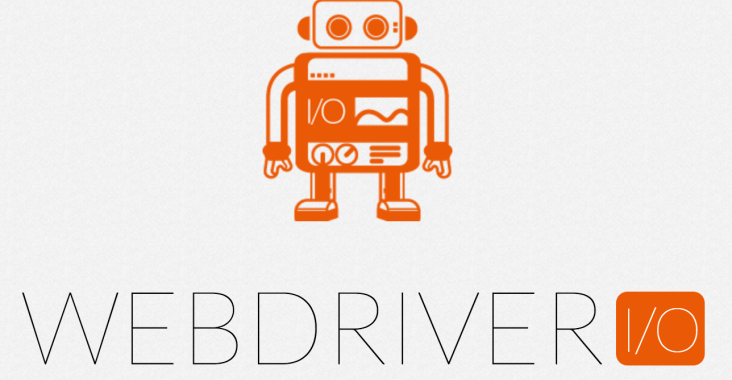

# wdio-demo

以 WebDriverIO 前端測試框架實際運行的範例

## 目錄

- [技術架構](#技術架構)
- [專案結構](#專案結構)
- [系統需求](#系統需求)
- [安裝](#安裝)
- [測試](#測試)
- [報表](#報表)
- [參考資料](#參考資料)

## 技術架構

### 前端測試框架

[WebDriverIO](http://webdriver.io/)



### Styles

- BDD Styles

### 斷言函式庫

- [mocha](https://mochajs.org/)
- [chai](http://chaijs.com/)

### 測試碼設計樣式

- [Page Objects Pattern](http://webdriver.io/guide/testrunner/pageobjects.html)

> Within your web app’s UI there are areas that your tests interact
> with. A Page Object simply models these as objects within the test
> code. This reduces the amount of duplicated code and means that if the
> UI changes, the fix need only be applied in one place.
>
> 簡單來說就是降低重複程式碼，當 UI 變動時，只需要修改一個地方

## 專案結構

```
.
├── ...
└── test
    ├── pageobjects
    └── specs
```

## 系統需求

- node 8
- npm 5 (or yarn 1)
- docker 17
- docker-compose 1.18.0
- Chrome Browser (dev environment)
- Firefox Browser (dev environment)
- webdriver-manager (dev environment)

## 安裝

```shell
$ npm i
```

or

```shell
$ yarn
```

### 開發環境安裝

selenium server in local：

```shell
$ npm install webdriver-manager chimp -g
$ webdriver-manager update
```

## 測試

### selenium server in local

```shell
$ webdriver-manager start
```

```shell
$ npm run dev-test
```

即時監聽 (需要加入 `@watch` 才會被監聽)：

```shell
$ npm run watch-test
```

### selenium server in drone

[How to install the Drone CLI](http://readme.drone.io/0.5/install/cli/)

```shell
$ npm run test-with-drone
```

## 報表 (需搭配 drone cli)

```shell
$ npm run test-with-drone
$ npm run gen-report
$ npm run open-report
```

## 參考資料

- [淺嚐 WebDriverIO](https://eden-liu.com/frontend/taste-webdriverio/)
- [Page Objects Pattern on WebDriverIO](https://eden-liu.com/frontend/page-objects-on-webdriverio/)
- [WebDriverIO with Docker](https://eden-liu.com/frontend/webdriverio-with-docker/)
- [WebDriverIO with CI](https://eden-liu.com/devops/webdriverio-with-ci/)